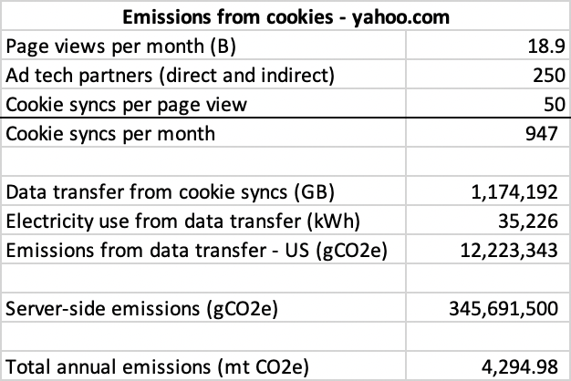

# Methodology to Measure Emissions from Cookie Syncs

## Input Data

1. Ad tech platforms that sync cookies get, on average, 20B cookie sync requests a day (proprietary Scope3 data).
2. Isolating the infrastructure used by ad tech platforms to manage cookies, including all technical infrastructure involved in processing the real-time requests, increased distribution to DSPs and other integration partners, and managing the storage of cookies and cookies syncs, produces an average of 219 mt of CO2e per month.

## Emissions per Cookie Sync

Using the above input data, we can calculate a "server-side" emissions cost per cookie sync of 0.000365 gCO2e.

In addition, we model the average data transfer per cookie sync, approximately 1.3 KB including both request and response. This is converted into emissions using the [data transfer methodology](./data_transfer.md).

## Ad Tech Platform Participation and Emissions Allocation

As of this writing (October 2022) we believe that all ad tech platforms still actively sync cookies. Should any ATP decide to rely only on persistent IDs, we will remove the cost of cookies from their estimated emissions.

## Sample emissions from cookies: Yahoo.com

To put this in a real-world context, using SimilarWeb we can pull estimated traffic data for yahoo.com. Using some heuristics for the number of ad tech partners and cookie syncs, we can estimate the annual emissions due to ad tech cookie synching as 4,295 mt CO2e - the same as burning 57 tanker trucks filled with gasoline.

