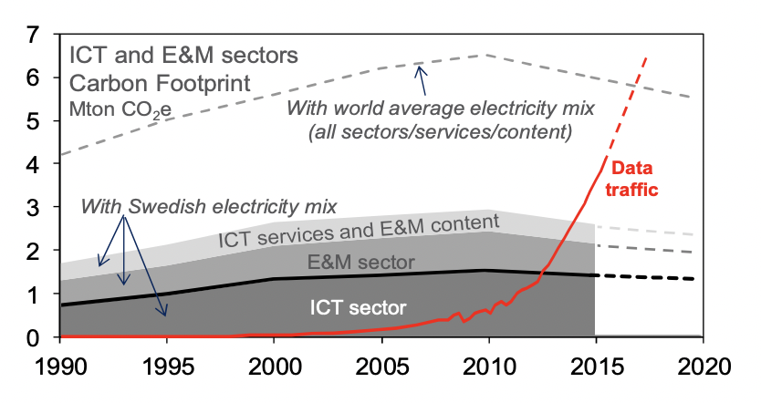
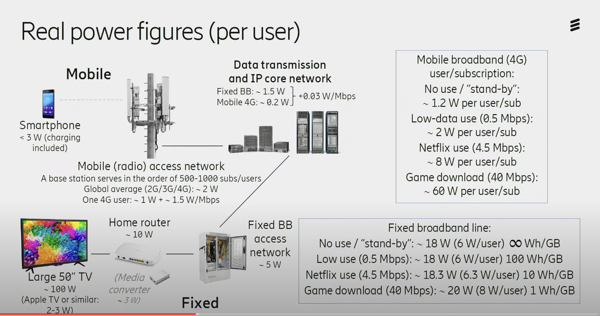

# Emissions from Data Transfer

## Approaches

As a starting point in understanding all the various approaches for understanding the carbon footprint of various networks, we recommend [this article by Gauthier Roussilhe](https://gauthierroussilhe.com/articles/explications-sur-l-empreinte-carbone-du-streaming-et-du-transfert-de-donnees).

## Carbon Footprint of the ICT Sector as a Whole



As a sanity check on the total environmental impact of network infrastructure, this paper: [The electricity consumption and operational carbon emissions of ICT network operators](https://www.diva-portal.org/smash/get/diva2:1177210/FULLTEXT01.pdf) uses confidential information provided by network operators to produce an estimate of the total and per-subscriber emissions.

> - The total annual operational carbon emissions of the ICT networks are estimated to 169 Mtonnes CO2e for 2015. This corresponds to 0.53% of the global carbon emissions related to energy (about 32 Gtonnes), or 0.34% of all carbon emissions (about 50 Gtonnes).
> - The total annual operational electricity consumption of the overall ICT networks globally is estimated to 242 TWh for 2015 including both grid (215 TWh) and on-site generated electricity (27 TWh). The total corresponds to 1.15% of the total electricity grid supply.

## Power consumption per network subscriber

The paper shows that electricity use and emissions per subscriber are relatively flat over the period 2010 to 2015 due to increased efficiency of the underlying technology (Moore's law), and demonstrates that electricity use and emissions are not growing proportionately to data transfer, which grew dramatically over this period.

The paper calculates emissions per fixed broadband (37 kgCO2e/sub) and mobile (14 kgCO2e/sub) subscribers, with an average of 19 kgCO2e per subscriber.

The same author, Jens Malmodin, produced a graphic showing the sources of power usage per user at the [Science & Society Forum](https://www.youtube.com/watch?v=Xo0PB5i_b4Y&t=2520s) in Sweden in 2020:


These bottom-up numbers indicate that the majority of emissions from broadband users are fixed and change little based on data transfer, while mobile emissions are somewhat based upon data transfer (presumably because the access network uses energy to transmit more actively). An expansion of this analysis that compares to other assessments of emissions from network use can be found in _IEA (2020), [The carbon footprint of streaming video: fact-checking the headlines](https://www.iea.org/commentaries/the-carbon-footprint-of-streaming-video-fact-checking-the-headlines), IEA, Paris_

## Power usage by bandwidth (Conventional Model)

For mobile vs fixed data the [2020 EU ICT impact study](https://circabc.europa.eu/sd/a/8b7319ba-ce4f-49ea-a6e6-b28df00b20d1/ICT%20impact%20study%20final.pdf) suggests 0.03 kWh/GB for fixed, 0.14 kWh/GB for mobile.

The 0.03 kWh/GB number aligns with what is in the graphic above (0.03 W/Mbps) at relatively low bandwidth. [Aslan et al](https://onlinelibrary.wiley.com/doi/10.1111/jiec.12630) suggest that fixed-line networks should be 0.06 kWh/GB in 2020 and halving every two years. This is consistent with the 0.03 kWh/GB figure.

SRI shared their calculations with us and their numbers, as of June 2022, are 0.036 kWh/GB for fixed and 0.249 for mobile, referencing "Evaluation environnementale des équipements et infrastructures numériques en France (2ème volet), ADEME-ARCEP, 2022 (p.71)."

Per DIMPACT methodology, "Range 0.1 – 1.0 kWh/GB (2020). After review of the available data the Carbon Trust used a value of 0.1 kWh/GB based on [Pihkoka et al](https://www.mdpi.com/2071-1050/10/7/2494) in their Whitepaper ‘Carbon impact of video streaming’ (2021)"

When we don't know anything about the connection, we are using a value of 0.1 kWh per GB from [Pihkoka et al](https://www.mdpi.com/2071-1050/10/7/2494).

| Connection type | Device            | KWh / GB |
| --------------- | ----------------- | -------- |
| Mobile          | Any               | 0.14     |
| Fixed broadband | Any               | 0.03     |
| Unknown         | Smartphone        | 0.14     |
| Unknown         | TV, PC, or Tablet | 0.03     |
| Unknown         | Unknown           | 0.10     |

## Power usage by time and bandwidth (Power Model)

Per [Media Trust](https://ctprodstorageaccountp.blob.core.windows.net/prod-drupal-files/documents/resource/public/Carbon-impact-of-video-streaming.pdf):

This white paper also presents a power model approach, which uses a marginal allocation methodology, where a baseload power is allocated per user, and a marginal energy component is allocated related to the data volume used. The power model approach recognises that the dynamic relation of energy to data volume in a network is very flat – i.e. there is a high fixed power baseload which does not vary in relation to the data volume, with
only a small increase in power consumption in response
to the data consumption.

### Fixed Network

Assumptions (see Table 5 in Carbon Trust doc):

- We diverge from Carbon Trust in that we assume one active device per household member vs their assumption that half of all user devices are active - this represents multiple people watching the same TV, for instance, or streaming on a maximum of one personal device at a time (in other words, we set A = 1 and Qd = 1)
- We also do not include an idle factor as it does not make sense to us to include all of the other uses of the network, many work-related like video calls, in our calculation (in other words, we set F = 1)
- We assume an average household size of 2

Coincidentally, these assumptions basically tie out to the same number as Carbon Trust - 3x the user factor times 1/3 the idle factor

```equation
Allocated Fixed Network Energy (Afn) = 6.5W / 2 users = 3.25W

Dynamic Fixed Network Energy (Dfn) = (0.03W/Mbps + 0.02W/75Mbps) = 0.030W/Mbps

Allocated Home Router Energy (Ehr) = 10W / 2 users = 5W

CDN = 1.3W

Fixed Network Energy = 9.55W + 0.03W/Mbps
```

### Mobile Network

We use the same numbers as Carbon Trust

```equation
Mobile Network Energy (Amn) = 1.2W + 1.53W/Mbps
```

### Power model coefficients

| Connection type | Constant (W) | Variable (W/Mbps) |
| --------------- | ------------ | ----------------- |
| Mobile          | 1.2          | 1.53              |
| Fixed           | 9.55         | 0.03              |

Data transmission rates
| Quality | Transmission rate (Mbps) |
| -- | --
| Low (480p) | 0.56
| Medium (720p) | 2.22
| High (1080p) | 6.67
| Ultra (4K) | 15.56

Streaming energy use by device, connection, and duration
| Device type | Connection Type | Rate | Energy Use
| -- | -- | -- | -- |
| TV | Fixed | Ultra | 10.0W
| PC or Tablet | Fixed | High | 9.75W
| Smartphone | Fixed | Medium | 9.6W
| PC or Tablet | Mobile | High | 11.4W
| Smartphone | Mobile | Medium | 4.6W

## References

### Malmodin and Lundén, 2018

Malmodin J, Lundén D. [The Energy and Carbon Footprint of the Global ICT and E&M Sectors 2010–2015](https://doi.org/10.3390/su10093027). Sustainability. 2018; 10(9):3027.
