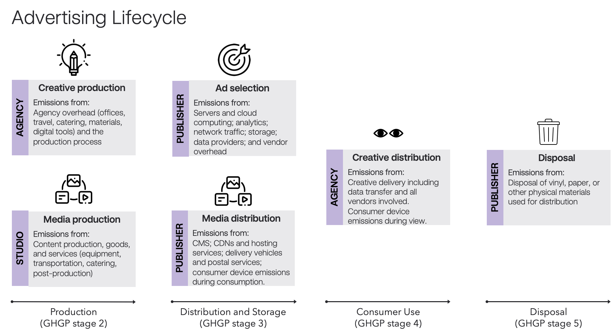

# Life Cycle Analysis for Advertising

Life cycle assessment or LCA (also known as life cycle analysis) is a methodology for assessing environmental impacts associated with all the stages of the life cycle of a commercial product, process, or service. For instance, in the case of a manufactured product, environmental impacts are assessed from raw material extraction and processing (cradle), through the product's manufacture, distribution and use, to the recycling or final disposal of the materials composing it (grave). (from ["Life-Cycle Assessment"](https://en.wikipedia.org/wiki/Life-cycle_assessment) - Wikipedia).

## Life Cycle Assessment of an Advertisement

To "manufacture" an ad impression, our raw materials are media (content), creative (the ad itself), and human attention (via ears and/or eyes). Different channels will have different combinations of these ingredients. For instance, a billboard often doesn't have content, just the ad. However, a billboard will have a disposal component when the vinyl is removed or recycled.

The life cycle of an ad can be broken down into two stages: production and distribution. The production phase includes media production and creative production. The distribution phase has four components:

1. Media distribution
1. Ad selection
1. Consumer engagement - the impression
1. Ad and media disposal

## Creative Production

The industry standard for measuring the carbon footprint of creative production is provided by [Ad Green](https://weareadgreen.org). See also [Green The Bid](https://www.greenthebid.earth) which focuses on reducing the impact of creative production.

## Media Production

The leading resource for measuring the environment impact of film and TV production in the UK is [Albert](https://wearealbert.org). Other countries have adopted or are adopting similar frameworks.

## Use Phase Methodologies

We have seen three well-documented methodologies for the use phase of media and advertising:

- [DIMPACT](https://dimpact.org/methodology)
- [SRI](https://www.sri-france.org/wp-content/uploads/2021/11/SRI_Calculating-the-carbon-footprint_VF.pdf)
- [GroupM](https://www.groupm.com/media-decarbonization-framework-groupm/)

### Life cycle boundaries by methodology

| Topic              | DIMPACT | SRI | GroupM |
| ------------------ | ------- | --- | ------ |
| Media distribution | Yes     | No  | Yes    |
| Ad selection       | No      | Yes | Yes    |
| Consumer view      | Yes     | Yes | No     |
| Disposal           | N/a     | N/a | No     |

### Channels covered

DIMPACT and SRI are digital-only. The GroupM methodology includes both digital and broadcast channels, including TV, OOH, cinema, and radio.

### Inclusion of emboddied emissions

Another key dimension to evaluate methodologies is whether they incorporate embodied emissions in each phase. To quote DIMPACT, "Use-phase emissions are those that result from the electricity and energy consumption of equipment used to process, transfer, and view content. What is excluded from this minimum boundary are the emissions from the raw material extraction, manufacturing, transport and installation of the equipment and devices used to serve and view digital content. These are known as ‘embodied emissions.'"

As an example from the SRI methodology:

| Topic                                                | DIMPACT | SRI | GroupM |
| ---------------------------------------------------- | ------- | --- | ------ |
| Requires embodied emissions for consumer device      | No      | Yes | Yes    |
| Requires embodied emissions for servers              | No      | No  | Yes    |
| Requires embodied emissions for networking equipment | No      | No  | Yes    |

### Scope 2 / Electricity

The GHG Protocol provides two methods for tracking Scope 2 emissions: the market-based method and the location-based method.

- The market-based method: calculates emissions based on the electricity that organizations have chosen to purchase, often spelled out in contracts or instruments like Renewable Energy Certificates (RECs).

- The location-based method: calculates emissions based on the emissions intensity of the local grid area where the electricity usage occurs.

| Topic                             | DIMPACT     | SRI | GroupM      |
| --------------------------------- | ----------- | --- | ----------- |
| Requires location-based emissions | Recommended | No  | Recommended |

### Ad Tech Supply Chain

The ad tech supply chain is a critical component to understand emissions from media and advertising companies. It is opaque and has multiple layers of intermediaries, making it difficult to fully understand.

DIMPACT is omitted as its methodology does not currently include ad selection.

| Topic                                                      | SRI         | GroupM      |
| ---------------------------------------------------------- | ----------- | ----------- |
| Includes emissions from programmatic vendors               | Yes         | Yes         |
| Includes emissions from data and identity providers        | Unspecified | Unspecified |
| Includes emissions from technology embedded into creatives | Unspecified | Unspecified |

### Grid allocation

Since the electricity grid is interconnected across regions, reducing energy in one region can actually impact the grid mix in an adjacent region. For instance, while Quebec is fully renewable on its own, it also exports green power to New York. Reducing electricity use in Quebec allows more to be exported to New York, which allows New York to turn off a "peaker" coal plant. This methodology is _marginal_ emissions. More information can be found [in this article](https://adgefficiency.com/energy-basics-average-vs-marginal-carbon-emissions/).

None of the methodologies currently specify a preference for average vs marginal emissions.

## Further investigation

- Should we incorporate other quantitative environmental issues into these methodologies? For instance, water intensity.
